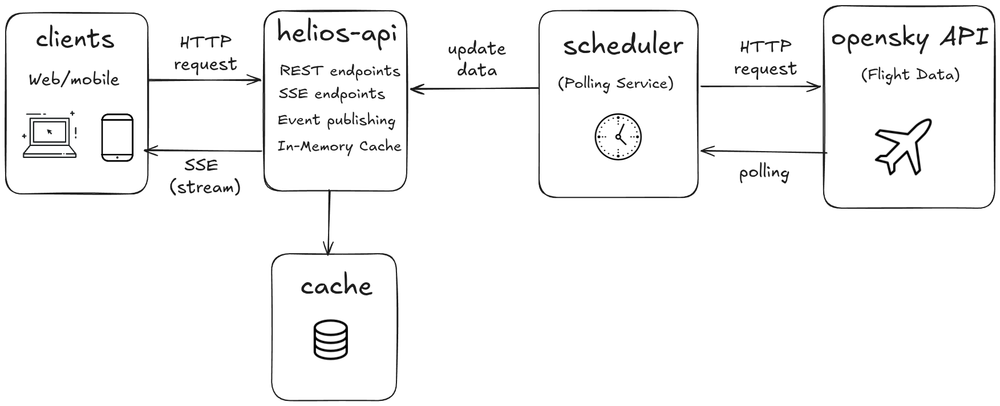

# Helios API

Helios API is a Spring Boot application designed to aggregate real-time flight data and serve it to clients via REST and Server-Sent Events (SSE).

## System Architecture

The following diagram illustrates the architecture of the Helios system:

### Key Components

*   **Clients (Web/Mobile)**: Connect to `helios-api` to make HTTP requests and receive live updates through a Server-Sent Events (SSE) stream.
*   **Helios API (`helios-api`)**: Serves REST and SSE endpoints, publishes events, and leverages an in-memory cache.
*   **Cache**: An in-memory cache system inside `helios-api` used to temporarily store and quickly retrieve flight data.
*   **Scheduler (Polling Service)**: A scheduling component that periodically polls the external OpenSky API for fresh flight data and pushes updates to the `helios-api`.
*   **OpenSky API**: External service that provides live flight data.

